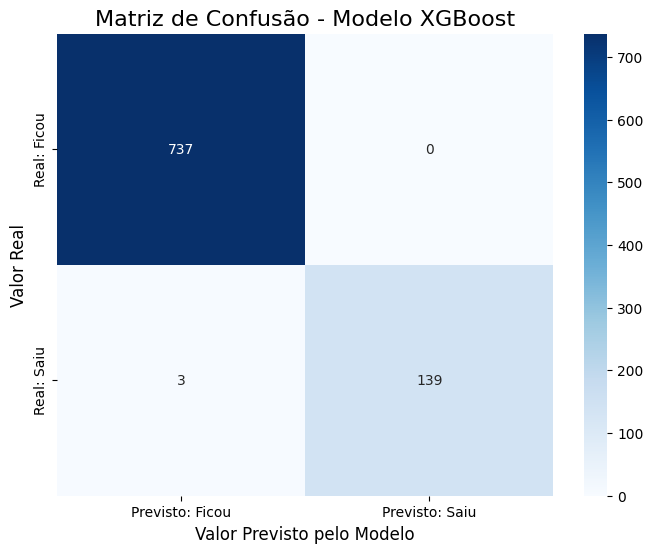

# 📑 Ficha Técnica: Modelo Preditivo de Rotatividade de Funcionários

---

## 1. 🎯 Objetivo do Projeto
Desenvolver um modelo de **aprendizado de máquina supervisionado** para prever com alta precisão a probabilidade de um funcionário deixar a organização (`Attrition`).  
O objetivo é permitir que o departamento de RH tome ações proativas para a retenção de talentos.  

---

## 2. 🛠️ Ferramentas e Dados
- **Plataforma:** Google Colab  
  🔗 [Abrir no Google Colab](https://colab.research.google.com/drive/1p5d-Es9vyEDT4pZgTCLkCM-ZCAHPJIsc?usp=sharing)) 
- **Linguagem e Bibliotecas:** Python (Pandas, Scikit-learn, XGBoost, Matplotlib, Seaborn)  
- **Fonte dos Dados:** Conjunto de dados de RH fornecido pela empresa, contendo **4.410 registros** iniciais com informações demográficas, de cargo, remuneração e histórico dos funcionários.  
- **Variável-Alvo:** `Attrition` (Saída do funcionário: **1 = Sim**, **0 = Não**).  

---

## 3. 🧹 Pré-processamento e Limpeza dos Dados
A preparação dos dados foi uma etapa crucial e envolveu os seguintes passos:  

- **Análise de Colunas Constantes:**  
  Remoção das colunas sem variação (`Over18`, `EmployeeCount`, `StandardHours`).  
- **Tratamento de Valores Nulos:**  
  - Remoção de **19 linhas** com dados ausentes em `NumCompaniesWorked`.  
  - Remoção de **2 linhas** com dados ausentes na variável-alvo `Attrition`.  
- **Conversão de Tipos de Dados:**  
  - `Attrition`: de texto ('Yes'/'No') para numérico (1/0).  
  - Colunas categóricas (`Department`, `Gender`, `JobRole`, etc.) → **LabelEncoder**.  
  - Ajuste de colunas numéricas (`MonthlyIncome`, `TotalWorkingYears`) para tipos adequados (`float64`, `Int64`).  

---

## 4. ✂️ Divisão dos Dados
- **Treinamento:** 80% dos dados  
- **Teste:** 20% dos dados  
- **Estratificação:** (`stratify=y`) para manter a mesma proporção de funcionários que saíram e ficaram nos dois conjuntos.  

---

## 5. 🤖 Modelagem e Comparação
Foram treinados e avaliados dois algoritmos de classificação:  

1. **Regressão Logística**  
   - **Acurácia:** 83.96%  
   - **Observação:** Serviu como modelo **baseline** para comparação.  

2. **XGBoost (XGBClassifier)**  
   - **Acurácia:** 99.66%  
   - **Observação:** Apresentou desempenho significativamente superior.  

---

## 6. ✅ Modelo Escolhido e Avaliação de Desempenho
O **modelo XGBoost** foi selecionado como solução final devido à sua altíssima acurácia.  

### 🔎 Análise da Matriz de Confusão
- **Previsões Corretas:**  
  - **737** funcionários que ficaram → previstos corretamente.  
  - **139** funcionários que saíram → previstos corretamente.  
- **Previsões Incorretas:**  
  - Apenas **3 erros (falsos negativos)** → funcionários que saíram mas foram previstos como permanentes.  
  - **0 falsos positivos** → nenhum funcionário previsto incorretamente como saída.  

📊 **Matriz de Confusão (XGBoost):**  

---

## 7. 📌 Conclusão Final
O modelo **XGBoost** demonstrou ser uma ferramenta **extremamente precisa e confiável** para prever a rotatividade de pessoal.  
Com **99.66% de acerto** e uma capacidade notável de evitar falsos positivos, pode ser implementado para ajudar o RH a:  

- Focar esforços de retenção nos funcionários com maior risco de saída.  
- Otimizar recursos.  
- Fortalecer a estabilidade da equipe.  

---

## 8. 🚀 Recomendações e Próximos Passos

### 🔹 1. Criar um Gráfico de Importância das Variáveis (Feature Importance)
- **O que é?** Mostra quais características (idade, salário, cargo, etc.) o modelo XGBoost mais utilizou nas previsões.  
- **Por que é importante?** Responde ao “**por que** os funcionários saem”, transformando o modelo de **caixa-preta** em uma ferramenta diagnóstica, com **insights acionáveis para o RH**.  

### 🔹 2. Análise de Erros e Perfis de Risco
- **O que é?** Isolar e analisar as características dos **3 funcionários previstos incorretamente**.  
- **Por que é importante?** Ajuda a entender as limitações do modelo e a identificar **“perfis de risco silencioso”**, possibilitando estratégias de retenção mais abrangentes.  

---

